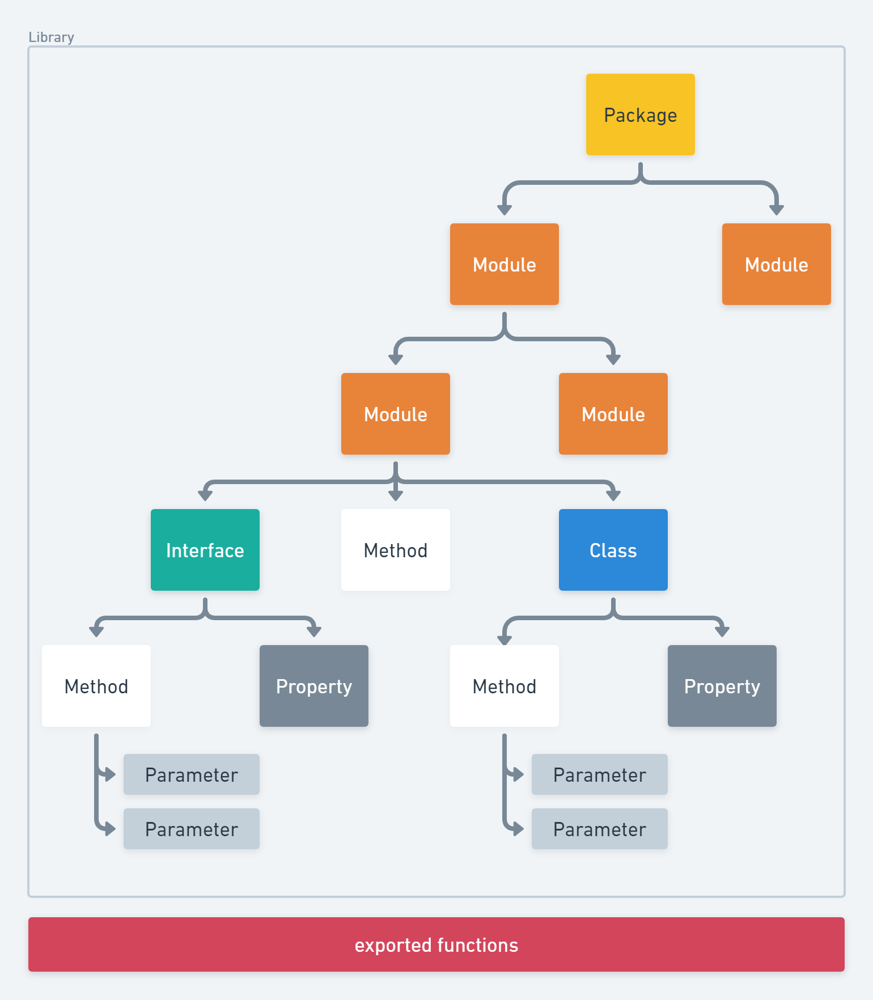
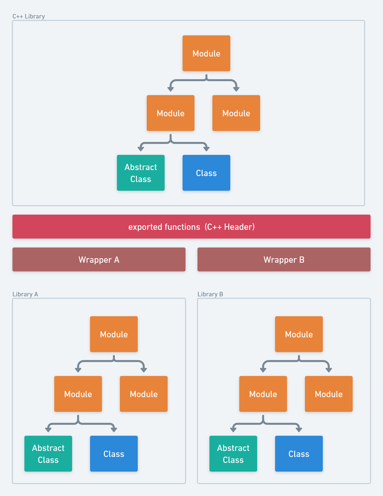
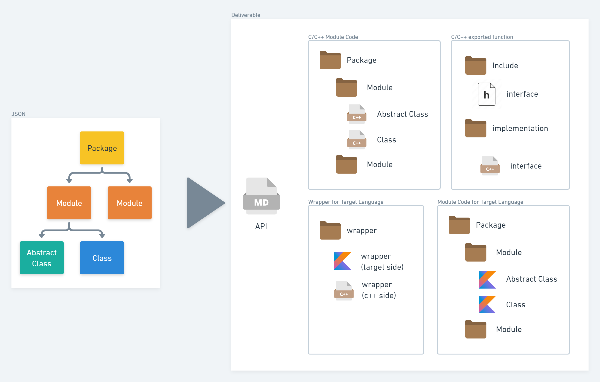
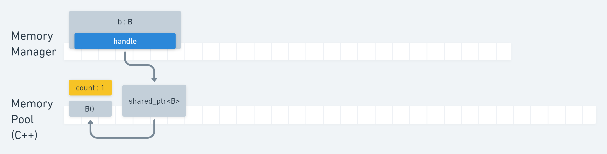
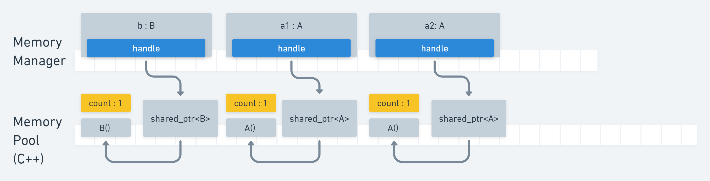
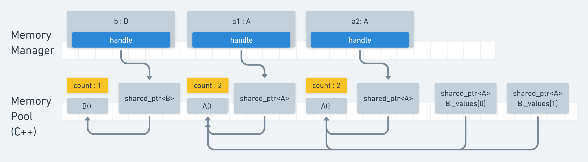
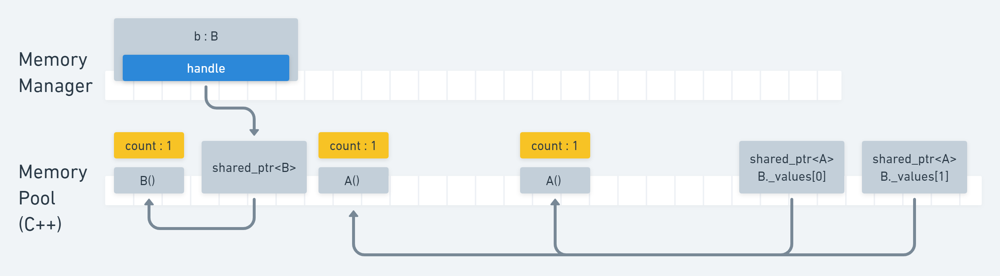
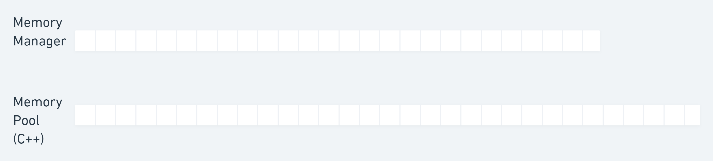

# Library Interface Generator

- [Library Interface Generator](#library-interface-generator)
  - [Introduction (소개)](#introduction-소개)
  - [Required JSON format (요구되는 JSON 포맷)](#required-json-format-요구되는-json-포맷)
    - [Package (패키지)](#package-패키지)
    - [Module (모듈)](#module-모듈)
    - [Interface (인터페이스)](#interface-인터페이스)
    - [Class (클래스)](#class-클래스)
    - [Enum (열거 클래스)](#enum-열거-클래스)
    - [Type (타입)](#type-타입)
    - [Property (프로퍼티)](#property-프로퍼티)
    - [Method (메소드)](#method-메소드)
    - [Parameter (파라미터)](#parameter-파라미터)
  - [Library Memory Management (라이브러리 메모리 관리)](#library-memory-management-라이브러리-메모리-관리)
    - [Memory Pool (메모리 풀)](#memory-pool-메모리-풀)
  - [Sample Deliverable (결과물 예시)](#sample-deliverable-결과물-예시)
    - [C++ Class & Interface Header](#c-class--interface-header)
      - [Input](#input)
      - [Output](#output)

This project converts the json that specifies the software module in the library to the API document, C/C++ header of the library, and library interface for each language.

이 프로젝트는 라이브러리에 있는 소프트웨어 모듈을 명세하는 json을 언어별 API 문서, 라이브러리의 C/C++ 헤더, 라이브러리 인터페이스로 변환합니다.

## Introduction (소개)



This software assumes that the library has the structure shown in the figure above.

A library has one top-level unit that contains all the functions of software. We define this as **package**.

A package is divided into several software units according to the logical classification of functions. We define this unit as **module**.

Modules can be subdivided into smaller units of modules.

Modules have **classes** and **interfaces** and **global method**.  
A class has **properties**, which are specifications for data, and **methods**, which are specifications for operations.  
Interfaces also have properties and methods.
 
An interface differs from a class in that an interface is a guideline for the functionality that a class from which it inherits must implement. Therefore, the functionality required by the interface is not implemented inside the interface. The implementation of the feature is implemented within a class that inherits the interface.

**Method** holds **parameters**, a set of data required to implement a function.

The library exports the functions provided by the software units introduced above as multiple functions that can be used externally.

이 소프트웨어는 라이브러리를 위 그림과 같은 구조를 가지고 있다고 가정하고 있습니다.

라이브러리는 소프트웨어가 가지고 있는 기능들을 모두 가지고 있는 하나의 최상위 단위가 있습니다. 이를 **패키지**라고 정의 합니다.

패키지는 기능의 논리적 분류에 따라 여러 가지의 소프트웨어 단위로 분화됩니다. 이 단위를 **모듈**로 정의합니다.

모듈은 더 작은 단위의 모듈로 분화될 수 있습니다.

모듈은 **클래스**와 **인터페이스**, **전역 메소드**를 보유합니다.  
클래스는 데이터에 대한 명세인 **프로퍼티**와 작업에 대한 명세인 **메소드**를 보유하고 있습니다.  
인터페이스 역시 프로퍼티와 메소드를 보유하고 있습니다.
  
인터페이스가 클래스와 다른 점은 인터페이스는 자신을 상속한 클래스가 구현해야 할 기능에 대한 가이드라인인 것입니다. 따라서, 인터페이스 내부에서 인터페이스가 요구되는 기능이 구현되지 않습니다. 기능의 구현은 인터페이스를 상속한 클래스 내에서 구현됩니다.

**메소드**는 기능을 구현하기 위한 필요한 데이터의 집합인 **파라미터**들을 보유하고 있습니다.

라이브러리는 위에서 소개한 소프트웨어 단위들이 제공하는 기능들을 외부에서 사용할 수 있는 여러 개의 함수로 내보냅니다. 



This project assumes that the user of the library will want to use the internal structure of the C/C++ library in the same form in various programming languages ​​and frameworks.
 
However, software libraries generally provide all functionality as a set of functions.

In order to reproduce the internal structure of the library in an external framework, the following process is required.

1. Provides a set of functions to use the functions of the library.
2. Attach a wrapper function to make a set of functions available to any framework.
3. Reproduce the internal structure in the framework you are using using wrapper functions.

이 프로젝트는 라이브러리의 사용자가 C/C++ 라이브러리가 가지고 있는 내부 구조를 다양한 프로그래밍 언어 및 프레임워크에서도 동일한 형태로 사용하기 원할 것을 가정하고 있습니다.

하지만, 소프트웨어 라이브러리는 일반적으로 모든 기능이 일련의 함수들로만 제공합니다.

외부 프레임워크에서 라이브러리의 내부 구조를 재현하기 위해서는 아래의 과정을 필요로 합니다.

1. 라이브러리의 기능을 사용할 수 있도록 일련의 함수를 제공합니다.
2. 일련의 함수를 어떤 프레임워크에서 사용할 수 있도록 래퍼 함수를 붙입니다.
3. 래퍼 함수들을 이용하여 사용하는 프레임워크에서 내부 구조를 재현합니다.



This project converts the module structure modeled in JSON into the output below.

1. API Documentation (Markdown)
2. Directories and C/C++ header files for each package, module, interface, and class
3. C/C++ headers for functions exported outside the library
4. Library wrapper code for target language and framework
5. A directory for each package, module, interface, class and code for that language/framework.

이 프로젝트는 JSON으로 모델링한 모듈 구조를 아래의 결과물로 변환합니다.

1. API 문서(Markdown)
2. 각 패키지, 모듈, 인터페이스, 클래스에 대한 디렉토리와 C/C++ 헤더 파일
3. 라이브러리 외부에로 내보내진 함수에 대한 C/C++ 헤더
4. 타겟 언어 및 프레임워크에 대한 라이브러리 래퍼 코드
5. 각 패키지, 모듈, 인터페이스, 클래스에 대한 디렉토리와 해당 언어/프레임워크에 대한 코드

## Required JSON format (요구되는 JSON 포맷)

```json
{
    "order" : "package",
    "name" : "packageA",
    "author" : "...",
    "description" : "...",
    "childs" : [
        {
            "order" : "module",
            "name" : "moduleA",
            "description" : "...",
            "childs" : [
                {
                    "order" : "module",
                    "name" : "moduleAA",
                    "description" : "...",
                    "childs" : [

                    ]
                }
            ]
        },
        {
            "order" : "module",
            "name" : "moduleB",
            "description" : "...",
            "childs" : [
                {
                    "order" : "interface",
                    "name" : "interfaceA",
                    "description" : "...",
                    "childs" : [
                        {
                            "order" : "enum",
                            "name" : "EnumA",
                            "description" : "...",
                            "values" : [
                                "A/1",
                                "B/2",
                                "C/3"
                            ]
                        },
                        {
                            "order" : "property",
                            "type" : "int32",
                            "name" : "propertyA",
                            "description" : "...",
                            "readonly" : true 
                        },
                        {
                            "order" : "method",
                            "type" : "int64",
                            "name" : "methodA",
                            "description" : "...",
                            "return" : "...",
                            "parameters" : [
                                {
                                    "order" : "parameter",
                                    "type" : "string",
                                    "name" : "paramA",
                                    "io" : "in",
                                    "description" : "..."
                                    
                                },
                                {
                                    "order" : "parameter",
                                    "type" : "bool",
                                    "name" : "paramB",
                                    "io" : "in",
                                    "description" : "..."
                                },
                                {
                                    "order" : "parameter",
                                    "type" : "packageA/moduleB/interfaceA/EnumA",
                                    "name" : "paramC",
                                    "io" : "in",
                                    "description" : "...",
                                }
                            ]
                        }
                    ]
                },
                {
                    "order" : "class",
                    "name" : "classA",
                    "base" : ["moduleB/interfaceA"],
                    "description" : "...",
                    "childs" : [
                        {
                            "order" : "property",
                            "type" : "int8",
                            "name" : "propertyC",
                            "readonly" : true,
                            "description" : "..."
                        },
                        {
                            "order" : "method",
                            "type" : "int16",
                            "name" : "methodD",
                            "description" : "...",
                            "return" : "...",
                            "parameters" : [
                                {
                                    "order" : "parameter",
                                    "type" : "array<int32>",
                                    "name" : "paramA",
                                    "io" : "out",
                                    "description" : "..."
                                },
                                {
                                    "order" : "parameter",
                                    "type" : "array<bool>",
                                    "name" : "paramB",
                                    "io" : "out",
                                    "description" : "..."
                                }
                            ]
                        }
                    ]
                },
                {
                    "order" : "method",
                    "type" : "bool",
                    "name" : "methodD",
                    "description" : "...",
                    "return" : "...",
                    "parameters" : [
                        {
                            "order" : "parameter",
                            "type" : "double",
                            "name" : "paramA",
                            "io" : "in",
                            "description" : "..."
                        },
                        {
                            "order" : "parameter",
                            "type" : "float",
                            "name" : "paramB",
                            "io" : "in",
                            "description" : "..."
                        },
                        {
                            "order" : "parameter",
                            "type" : "array<moduleB/interfaceA>",
                            "name" : "paramC",
                            "io" : "in",
                            "description" : "..."
                        },
                        {
                            "order" : "parameter",
                            "type" : "moduleB/classA",
                            "name" : "paramD",
                            "io" : "out",
                            "description" : "..."
                        }
                    ]
                }
            ]
        }
    ]
}
```

Above is an overview of the JSON format your project will need to write in order to get the output it needs. 
Take a look at the JSON object for each order below.

위는 필요한 출력을 얻기 위해 프로젝트에서 작성해야 하는 JSON 형식의 개요입니다.  
아래에서 각 분류에 대한 JSON 객체를 살펴보겠습니다.

### Package (패키지)

**Package** is the highest level of software. The package name determines the name of the library or the top-level namespace of the library's C++ code.

**패키지**는 소프트웨어의 최상위 단위입니다. 패키지 이름이 라이브러리의 이름이나 라이브러리 C++ 코드의  최상위 네임스페이스를 결정합니다.

```json
{
    "order" : "package",
    "name" : "packageA",
    "author" : "...",
    "description" : "...",
    "childs" : [
    ]
}
```

|*field name*|*description*|
|:-:|:--|
|order|The type of json object. pinned to "package"|
|name|The name of the package. It is recommended to name the library.|
|author|library creator|
|description|Description of library features|
|childs|The software modules of the highest layer possessed by the library|

|*필드 이름*|*설명*|
|:-:|:--|
|order|json 객체의 유형입니다. "package"로 고정입니다.|
|name|패키지의 이름. 라이브러리 이름을 정하는 것이 좋습니다.|
|author|라이브러리 제작자|
|description|라이브러리 기능에 대한 설명|
|childs|라이브러리가 보유하고 있는 가장 상위 계층의 소프트웨어 모듈들|

### Module (모듈)

**Module** is a unit of software. The name of the module determines the directory or namespace containing the class code.

**모듈**은 소프트웨어의 단위입니다. 모듈의 이름이 클래스 코드가 담긴 디렉토리나 네임스페이스를 결정합니다.

```json
{
    "order" : "module",
    "name" : "moduleA",
    "description" : "...",
    "childs" : [
    ]
}
```

|*Field name*|*Description*|
|:-:|:--|
|order|The type of the json object. Fixed as "module".|
|name|Name of the module|
|description|Description of module function|
|childs|Submodules or global methods of modules|

|*필드 이름*|*설명*|
|:-:|:--|
|order|json 객체의 유형. "module"로 고정입니다.|
|name|모듈의 이름|
|description|모듈 기능에 대한 설명|
|childs|하위 모듈들 또는 모듈의 전역 메소드|

### Interface (인터페이스)

**Interfaces** are guidelines for the methods and properties that a class must implement. *Classes* inherit interfaces to implement methods and properties.

**인터페이스**는 클래스가 구현해야 할 메소드와 프로퍼티에 대한 가이드라인입니다. *클래스*는 인터페이스를 상속하여 메소드와 프로퍼티를 구현합니다.

```json
{
    "order" : "interface",
    "name" : "interfaceA",
    "description" : "...",
    "childs" : [
    ]
}
```

|*Field name*|*Description*|
|:-:|:--|
|order|The type of the json object. Fixed as "interface".|
|name|Name of the interface|
|description|Description of the role of the interface|
|childs|method or property|

|*필드 이름*|*설명*|
|:-:|:--|
|order|json 객체의 유형. "interface"로 고정입니다.|
|name|인터페이스의 이름|
|description|인터페이스의 역할에 대한 설명|
|childs|메소드 또는 프로퍼티|

### Class (클래스)

**Class** is a logical set of methods and properties.
**클래스**는 메소드와 프로퍼티에 대한 논리적 집합입니다. 

```json
{
    "order" : "class",
    "name" : "classA",
    "base" : ["moduleA/interfaceA"],
    "description" : "...",
    "childs" : [
    ]
}
```

|*Field name*|*Description*|
|:-:|:--|
The type of the |order|json object. Fixed as "class".|
|name|Name of class|
|base|Classes or interfaces from which this class inherits|
|description|A description of the role of the class|
|childs|method or property|

|*필드 이름*|*설명*|
|:-:|:--|
|order|json 객체의 유형. "class"로 고정입니다.|
|name|클래스의 이름|
|base|이 클래스가 상속한 클래스나 인터페이스들|
|description|클래스의 역할에 대한 설명|
|childs|메소드 또는 프로퍼티|

### Enum (열거 클래스)

**Enum** is a set of named constants.
**Enum**은 이름을 가진 상수의 집합입니다.

```json
{
    "order" : "enum",
    "name" : "enumA",
    "description" : "...",
    "values" : [
        "A/1",
        "B/2",
        "C/3"
    ]
}
```

|*Field name*|*Description*|
|:-:|:--|
|order|The type of the json object. Fixed as "enum".|
|name|Name of enumeration class|
|description|Description of the role of the enumeration class|
|values|expressed as an array of strings. String must be expressed as "constant name/constant value (integer)"|

|*필드 이름*|*설명*|
|:-:|:--|
|order|json 객체의 유형. "enum"로 고정입니다.|
|name|열거 클래스의 이름|
|description|열거 클래스의 역할에 대한 설명|
|values|문자열의 배열로 표현이 됨. 문자열은 "상수 이름/상수 값(정수)"로 표현하여야 함|

### Type (타입)

All types supported by the library are introduced below. Used in the "type" field of properties, methods, and parameters.

라이브러리에서 지원하는 모든 타입들을 아래에서 소개합니다. 프로퍼티, 메소드, 파라미터의 "type" 필드에서 사용됩니다. 

|Type|Description|
|:-:|:--|
|void|empty type|
|int8|Used as byte or char|
|int16|Used as short|
|int32|Used as int|
|int64|Used as long|
|float|32bit real|
|double|64-bit real|
|string|Commonly used string|
|class|**Only classes or interfaces within the library can be used.** Used as 'module/class'. |
|enum|**Only enum within the library can be used.** Used as 'module/enum'. |
|array\<T\>|Fixed array of type T|
|vector\<T\>|dynamic array of type T|

|타입|설명|
|:-:|:--|
|void|타입 없음|
|int8|byte나 char로 쓰임|
|int16|short로 쓰임|
|int32|int로 쓰임|
|int64|long으로 쓰임|
|float|32bit 실수|
|double|64bit 실수|
|string|일반적으로 사용하는 문자열|
|class|**라이브러리 내부의 클래스나 인터페이스만 사용 가능함.**'  module/class'로 쓰임. |
|enum|**라이브러리 내부의 클래스나 인터페이스만 사용 가능함.**'  module/enum'로 쓰임. |
|array\<T\>|T 타입의 고정 배열|
|vector\<T\>|T 타입의 동적 배열|

### Property (프로퍼티)

**Properties** are data that can be modified outside the class.
**프로퍼티**는 클래스 외부에서 수정 가능한 데이터입니다.

```json
{
    "order" : "property",
    "type" : "int8",
    "readonly" : true, 
    "name" : "propertyC",
    "description" : "..."
}
```

|*Field name*|*Description*|
|:-:|:--|
The type of the |order|json object. Fixed as "property".|
|name|Name of the property|
|type|Data type of the property|
|readonly|If the value is true, this property is read-only; if false, it is read-write.|
|description|Description of the role of the property|

|*필드 이름*|*설명*|
|:-:|:--|
|order|json 객체의 유형. "property"로 고정입니다.|
|name|프로퍼티의 이름|
|type|프로퍼티의 데이터 타입|
|readonly|해당 값이 참이면 이 프로퍼티는 읽기만 가능하고, 거짓이면 읽고 쓰기가 가능하다.|
|description|프로퍼티의 역할에 대한 설명|

### Method (메소드)

**Methods** are operations that a class can perform.
**메소드**는 클래스가 수행가능한 작업입니다.

```json
{
    "order" : "method",
    "type" : "int8",
    "name" : "methodA",
    "description" : "...",
    "return" : "...",
    "parameters" : [

    ]
}
```

|*Field name*|*Description*|
|:-:|:--|
The type of the |order|json object. Fixed as "method".|
|name|Name of the method|
|type|Data type of the method|
|description|Description of the method's role|
|return|Description of the return value of the method|
|parameters|메소드의 인자들|

|*필드 이름*|*설명*|
|:-:|:--|
|order|json 객체의 유형. "method"로 고정입니다.|
|name|메소드의 이름|
|type|메소드의 데이터 타입|
|description|메소드의 역할에 대한 설명|
|return|메소드의 리턴 값에 대한 설명|
|parameters|메소드의 인자들|

> If field "name" is "constructor", the JSON object for this method means the constructor.
> "name" : "constructor"일 경우, 이 메소드에 대한 JSON 오브젝트는 생성자를 의미합니다.

### Parameter (파라미터)

**parameters** are data needed to execute the method.
**파라미터**는 메소드를 수행하기 위해 필요한 데이터들입니다.

```json
{
    "order" : "parameter",
    "type" : "int8",
    "name" : "paramA",
    "description" : "...",
    "io" : "in"
}
```

|*Field name*|*Description*|
|:-:|:--|
The type of the |order|json object. Fixed by "parameter".|
|name|Name of parameter|
|type|Data type of the parameter|
|description|Description of the role of the parameter|
|io|The input/output direction of the parameter. "in" means an input parameter and "out" means an output parameter.|

|*필드 이름*|*설명*|
|:-:|:--|
|order|json 객체의 유형. "parameter"로 고정입니다.|
|name|파라미터의 이름|
|type|파라미터의 데이터 타입|
|description|파라미터의 역할에 대한 설명|
|io|파라미터의 입출력 방향. "in"은 입력 파라미터, "out"은 출력 파라미터를 의미한다.|

## Library Memory Management (라이브러리 메모리 관리)

The purpose of this project is to make it easy to use the C++ library in other languages ​​or frameworks.  

The reason why it is difficult to use C++ class objects in class objects of other languages ​​is because memory management methods differ according to languages ​​and frameworks.  
For example, C/C++ objects require the manager to free memory directly or use smart pointers, whereas Java/Kotlin objects free memory automatically by the language's memory manager.

In languages ​​where memory is automatically managed (Java/Kotlin), the library created in this project provides native functions so that the administrator can automatically allocate and deallocate memory.  

이 프로젝트의 목적은 C++ 라이브러리를 다른 언어 혹은 프레임워크에서 쉽게 사용하기 위함입니다.

C++ 클래스 오브젝트를 다른 언어의 클래스 오브젝트에서 쓰기 어려운 이유는 언어 및 프레임워크에 따라 메모리 관리 방식이 다르기 때문입니다.  
예를 들어, C/C++ 오브젝트는 관리자가 직접 메모리를 해제하거나 스마트 포인터를 사용해야 하지만 Java/Kotlin 오브젝트는 언어의 메모리 관리자에 의해 메모리가 자동으로 해제합니다.

자동으로 메모리가 관리가 되는 언어(Java/Kotlin)에서 관리자가 자동으로 메모리 할당 및 할당해제를 할 수 있도록, 이 프로젝트에서 생성된 라이브러리는 Native function을 제공합니다.  

### Memory Pool (메모리 풀)

The native function provided by the library created in this project uses the memory pool to allocate and deallocate internally.

When an object is created in an automatic memory management language, the library memory pool created automatically by the project allocates a C++ object and passes a handle to the object.  
When an object is deallocated in an automatic memory management language, the C++ object is deallocated from the memory pool via handle.

이 프로젝트에서 만든 라이브러리에서 제공하는 Native function은 내부에서 메모리 풀을 활용하여 할당 및 할당 해제를 합니다.

자동 메모리 관리 언어에서 객체가 생성될 때, 프로젝트가 자동으로 생성한 라이브러리 메모리풀이 C++ 객체를 할당하고 handle을 객체에 넘겨줍니다.  
자동 메모리 관리 언어에서 객체가 할당해제 될 때, handle을 통해 C++ 객체를 메모리 풀로부터 할당해제 합니다.

Below is an example of how this project utilizes C++ objects in an automatic memory management language through memory pools.

아래는 이 프로젝트가 메모리 풀을 통해 어떻게 자동 메모리 관리 언어에서 C++ 객체를 활용하는 지에 대한 예시입니다. 

*MemoryPool.h*

```cpp
#if !defined(__LIBRARY_MEMORY_POOL_20220531__)
#define __LIBRARY_MEMORY_POOL_20220531__
#include <memory>

namespace Library
{
    class MemoryPool
    {
    public:
        /* \brief : initialize memory pool.
         * @param block_num  The maximum number of usable blocks in the memory pool
         * @return Whether the initialization is successful
         */
        static bool initialize(size_t block_num);
        
        /*
        * \brief release memory pool
        */
        static void release();

        /* \brief check if memory pool is initialized
        * @return wheter the initialization is successful
        */        
        static bool initialized();
        
        /*
        * \brief allocate object
        * @param n number of objects to allocate
        * @return Address of the first object allocated
        */
        template<class T>
        static T* allocate(size_t n = 1);
        
        /*
        * \brief deallocate object
        * @param ptr Address of the first object allocated
        * @param n Total number of allocated objects
        */
        template<class T>
        static void deallocate(T* ptr, size_t n=1);
    }

    
    /*
    * \brief  Allocator required to allocate memory in container classes such as vector
    */
    template<class T>
    struct MemoryAllocator;
}
#endif
```

Above is the memory pool automatically created by the project. All classes created in this project refer to this memory pool.  
위는 프로젝트에서 자동생성하는 메모리 풀입니다. 이 프로젝트에서 만든 모든 클래스는 이 메모리 풀를 참조합니다.

```cpp
#include <vector>
#include <memory>
#include "MemoryPool.h"
namespace Library
{
    class A
    {
    public:
       explicit A(int32_t value = 0) : _value(value) {}
    private:
        int32_t _value;
    }

    class B
    {
    public:
        explicit B() {}
        void push(std::shared_ptr<A> value) {
            _values.push_back(value);
        }

    private:
        std::vector<std::shared_ptr<A>, Library::MemoryAllocator<A>> _values;
    }
}
```

```kotlin
class A
{
    constructor(value : Int)
}

class B
{
    constructor()
    fun push(value : A)
}
```

C++ sample classes used in the library created in this project and Kotlin classes that mimic those classes.

이 프로젝트에서 만든 라이브러리에서 쓰이는 C++ 샘플 클래스들과 그 클래스들을 모사한 Kotlin 클래스입니다. 

To see how memory is allocated and deallocated in an automatic memory management language, we do the following:

1. Allocate b, which is an instance of class B.
2. Allocate a1, a2 instances of class A.
3. Add a1,a2 to b.
4. Deallocate a1, a2.
5. Deallocate b.

자동 메모리 관리 언어에서 메모리가 어떻게 할당 및 할당해제가 되는지 살펴보기 위해 아래의 작업을 수행합니다.

1. class B의 인스턴스인 b을 할당합니다.
2. class A의 인스턴스인 a1, a2를 할당합니다.
3. b에 a1,a2를 추가합니다.
4. a1, a2를 할당해제합니다.
5. b를 할당해제합니다.

```kotlin
fun pushA(b : B)
{
    // 2. Create a1, a2
    val a1 = A()
    val a2 = A()
    // 3. push a1, a2 to b
    b.push(a1)
    b.push(a2)
}
fun createB()
{
    // 1. Create b
    val b = B()
    pushA(b)
    // 4. Remove a1, a2
}
fun main() {
    createB()
    // 5. Remove b
}
```

To do the above in Kotlin, we run the main function in the example above.
At this time, I will explain below how the memory pool changes according to each stage.

코틀린에서 위의 작업을 수행하기 위해 위 예시의 main 함수를 실행합니다.
이 때, 각 단계에 따라 메모리 풀이 어떻게 변하는 지 아래에서 설명하겠습니다.

1. Create a B object, b, in Kotlin. After creating a std::shared_ptr for b in the memory pool, pass the handle to the shared_ptr to the object b.  
The shared_ptr reference count of object b is 1.  
Kotlin에서 B 객체인 b를 생성합니다. 메모리 풀에서 b에 대한 std::shared_ptr을 만든 뒤, shared_ptr에 대한 핸들을 b 오브젝트에 넘깁니다.  
오브젝트 b의 shared_ptr 참조 계수는 1입니다.  



2. Create A objects a1, a2 in Kotlin.  
After creating std::shared_ptr for a1 and a2 in the memory pool, the handle to shared_ptr is passed to a1 and a2 respectively.  
The shared_ptr reference count of objects a1 and a2 is 1.  
Kotlin에서 A 객체인 a1, a2를 생성합니다. 메모리 풀에서 a1, a2에 대한 std::shared_ptr로 만든 뒤, shared_ptr에 대한 핸들은 각각 a1, a2에 넘깁니다. 오브젝트 a1, a2의 shared_ptr 참조 계수는 1입니다.



3. In Kotlin, put a1, a2 into A vector(_values) of B.  
   Make the first element of B a shared_ptr to A and refer to the original memory address of a1. The reference count to the original memory of a1 is incremented.  
   Make the second element of B a shared_ptr to A and reference the original memory address of a2. The reference count to the original memory of a2 is increased.  
   Kotlin에서 a1, a2를 B의 A vector(_values)에 넣습니다.  
   B의 첫번째 원소를 A에 대한 shared_ptr로 만들고 a1의 원본 메모리 주소를 참조합니다. a1의 원본 메모리에 대한 참조 계수가 올라갑니다.  
   B의 두 번째 원소를 A에 대한 shared_ptr로 만들고 a2의 원본 메모리 주소를 참조합니다. a2의 원본 메모리에 대한 참조 계수가 올라갑니다. 
 


4. Deallocate a1, a2 in Kotlin.  
   The shared_ptr pointing to the original memory of a1, a2 disappears, and the reference count for a1, a2 decreases.  
   Kotlin에서 a1, a2을 할당 해제합니다. a1, a2의 원본 메모리를 가리키는 shared_ptr이 사라지고 a1, a2에 대한 참조 계수는 줄어듭니다.



5. Deallocate B in Kotlin.  
The shared_ptr pointing to b's original memory disappears. Since the reference count for b is zero, the original memory for b is deallocated.  
When b's original memory is deallocated, the A vector in b is also deallocated.  
All shared_ptr in A vector is also deallocated.  
The original memory pointed to by shared_ptr is also deallocated because its reference count is 0.  
Kotlin에서 B를 할당해제합니다.  
b의 원본 메모리를 가리키는 shared_ptr이 사라집니다.  
b에 대한 참조 계수가 0이므로 b의 원본 메모리가 할당해제됩니다.  
b의 원본 메모리가 할당 해제되면 b 안의 A vector도 할당해제됩니다.  
A vector 안에 있는 shared_ptr도 전부 할당해제됩니다.  
shared_ptr이 가리키던 원본 메모리도 참조 계수가 0이 되므로 할당해제됩니다.



## Sample Deliverable (결과물 예시)

### C++ Class & Interface Header

#### Input

```json
{
    "order" : "package",
    "name" : "Vertebrate",
    "author" : "Jaechun Choe",
    "description" : "Libraries for mimicking vertebrate behavior",
    "childs" : [
        {
            "order" : "module",
            "name" : "Mammalia",
            "description" : "Module for simulating mammalia",
            "childs" : [
                {
                    "order" : "interface",
                    "name" : "Dog",
                    "description" : "Interfaces to dog features or behaviors",
                    "childs" : [
                        {
                            "order" : "enum",
                            "name" : "FurColor",
                            "description" : "the color of fur",
                            "values" : [
                                "RED/1",
                                "BLUE/2",
                                "GREEN/3",
                            ]
                        },
                        {
                            "order" : "property",
                            "name" : "fur",
                            "type" : "Vertebrate/Mammalia/Dog/FurColor",
                            "readonly" : false,
                            "description" : "dog hair color"
                        },
                        {
                            "order" : "method",
                            "name" : "bark",
                            "type" : "double",
                            "description" : 
                                "barks when it sees dangerous objects.",
                            "return" : "decibel of the barking sound"
                            "parameters" : [
                                {
                                    "order" : "parameter",
                                    "type" : "int32",
                                    "name" : "obj",
                                    "io" : "in",
                                    "description" : "hazard of the object"
                                }
                            ]
                        },
                        {
                            "order" : "method",
                            "name" : "cross",
                            "type" : "Vertebrate/Mammalia/Dog",
                            "description" : "Mate with other dog and produce new dog.",
                            "return" : "the new dog",
                            "parameters" : [
                                {
                                    "order" : "parameter",
                                    "type" : "Verbrate/Mammalia/Dog",
                                    "name" : "mate",
                                    "io" : "in",
                                    "description" : "other dog"
                                }
                            ]
                        }                        
                    ]
                },
                {
                    "order" : "class",
                    "name" : "Jindo",
                    "base" : ["Vertebrate/Mammalia/Dog"]
                    "description" : "Interfaces to jindo dog features or behaviors",
                    "childs" : [
                        {
                            "order" : "method",
                            "name" : "consturctor",
                            "type" : "void",
                            "description" : "constructor of the jindo dog",
                            "return" : "",
                            "parameters" : [
                                {
                                    "order" : "parameter",
                                    "type" : "int32",
                                    "name" : "age",
                                    "io" : "in",
                                    "description" : "age for the jindo dog"
                                }
                            ]
                        },
                        {
                            "order" : "method",
                            "name" : "guard",
                            "type" : "void",
                            "description" : "guard the house",
                            "return" : "none",
                            "parameters" : [
                                {
                                    "order" : "parameter",
                                    "type" : "string",
                                    "name" : "address",
                                    "io" : "in",
                                    "description" : "home address to guard"
                                }
                            ]
                        }                       
                    ]
                }
            ]
            
        }
    ]
}
```

#### Output

1. Dog.hpp

```cpp
#if !defined(__VERTEBRATE_MAMMALIA_DOG_20220530__)
#define __VERTEBRATE_MAMMALIA_DOG_20220530__

#include "../MemoryPool/MemoryPool.h"
#include <memory>
#include <string>

namespace Vertebrate
{
    namespace Mammalia
    {
        /*
        * \brief Interfaces to dog features or behaviors
        */
        class Dog
        {
            // \brief the color of fur
            enum class FurColor
            {
                RED = 1,
                BLUE = 2,
                GREEN = 3,
            }

            explicit Dog();
            virtual ~Dog();

            /*
            * Property name : fur
            * \brief dog hair color
            */
            virtual void setFur(const Vertebrate::Mammalia::Dog::FurColor value) = 0;
            virtual Vertebrate::Mammalia::Dog::FurColor getFur()= 0;

            /* brief : barks when it sees dangerous objects.
             * @param[in] obj hazard of the object
             * @return decibel of the barking sound
             */
            virtual double bark(const int32_t obj) = 0;

            /* brief : Mate with other dog and produce new dog.
             * @param[in] mate other dog
             * @return the new dog
             */
            virtual std::shared_ptr<Vertebrate::Mammalia::Dog> cross(const std::shared_ptr<Vertebrate::Mammalia::Dog>& mate) = 0;

        }
    }
}

#endif // __VERTEBRATE_MAMMALIA_DOG_20220530__
```

2. Jindo.hpp

```cpp
#if !defined(__VERTEBRATE_MAMMALIA_JINDO_20220530__)
#define __VERTEBRATE_MAMMALIA_JINDO_20220530__

#include "../MemoryPool/MemoryPool.h"
#include <memory>
#include <string>

namespace Vertebrate
{
    namespace Mammalia
    {
        /*
        * \brief Interfaces to dog features or behaviors
        */
        class Jindo : public Vertebrate::Mammalia::Dog
        {
            /*
            * \brief constructor of the jindo dog
            * @param[in] age  age for the jindo dog
            */
            explicit Jindo(const int age);
            virtual ~Jindo();

            /*
            * Property name : fur
            * \brief dog hair color
            */
            void setFur(const Vertebrate::Mammalia::Dog::FurColor value) override;
            Vertebrate::Mammalia::Dog::FurColor getFur() override;

            /* \brief : barks when it sees dangerous objects.
             * @param[in] obj hazard of the object
             * @return decibel of the barking sound
             */
            double bark(int32_t obj) override;

            /* \brief : Mate with other dog and produce new dog.
             * @param[in] mate other dog
             * @return the new dog
             */
            std::shared_ptr<Vertebrate::Mammalia::Dog> cross(const std::shared_ptr<Vertebrate::Mammalia::Dog>& mate) override;

            /* \brief : guard the house
            * @param[in] address  home address to guard
            * @return none
            */
            void guard(const std::string address);
        }
    }
}

#endif // __VERTEBRATE_MAMMALIA_JINDO_20220530__
```

3. Vertebrate.h
```cpp
#if !defined(__VERTEBRATE_20220530__)
#define __VERTEBRATE_20220530__

#include "Mammalia/Dog.hpp"
#include "Mammalia/Jindo.hpp"
#include "MemoryPool/MemoryPool.h"

#endif
```

4. VertebrateNativeInterface.h

```cpp
#if !defined(__VERTEBRATE_MAMMALIA_NATIVE_INTERFACE_20220530__)
#define __VERTEBRATE_MAMMALIA_NATIVE_INTERFACE_20220530__

#include <memory>
#include <string>
#include <cstdlib>

#include <Vertebrate.h>

#ifdef VERTEBRATE_EXPORT
#define VERTEBRATE_API
#else
#define VERTEBRATE_API
#endif

namespace VertebrateAPI
{
    namespace Mammalia
    {
        namespace Dog
        {
            extern VERTEBRATE_EXPORT void* construct();
            extern VERTEBRATE_EXPORT void release(void* self);

            extern VERTEBRATE_EXPORT void setFur(void* self, const int32_t value);
            extern VERTEBRATE_EXPORT int32_t getFur(void* self);
            extern VERTEBRATE_EXPORT double bark(void* self, const int32_t obj);
            extern VERTEBRATE_EXPORT void* cross(void* self, const void* mate);
        }

        namespace Jindo
        {
            extern VERTEBRATE_EXPORT void* construct(const int32_t age);
            extern VERTEBRATE_EXPORT void release(void* self);

            extern VERTEBRATE_EXPORT void setFur(void* self, const int32_t value);
            extern VERTEBRATE_EXPORT int32_t getFur(void* self);
            extern VERTEBRATE_EXPORT double bark(void* self, const int32_t obj);
            extern VERTEBRATE_EXPORT void* cross(void* self, const void* mate);

            extern VERTEBRATE_EXPORT void guard(void* self, const std::string& address);
        }
    }
}

```

5. VertebrateNativeInterfaceJNI.cpp

```cpp
#include <jni.h>
#include <android/log.h>
#include <string>

#include <VertebrateNativeInterface.h>

inline std::string toCString(JNIEnv* env, jstring j_str)
{
    const char* str = env->GetStringUTFChars((jstring)j_str, NULL);
    std::string ret = std::string(str);
    return ret;
}

inline jstring toJString(JNIEnv* env, const std::string& c_str)
{
    const char* str = c_str.data();
    return env->NewStringUTF(str);
}

using namespace VertebrateAPI;

extern "C" JNIEXPORT jlong JNICALL Java_com_vertebrate_vertebrate_Vertebratejni_Mammalia_Dog_construct
(JNIEnv* env, jobject _this)
{
    void* result = Mammalia::Dog::construct();
    jlong jresult = (jlong)result;
    return jresult;
}

extern "C" JNIEXPORT void JNICALL Java_com_vertebrate_vertebrate_Vertebratejni_Mammalia_Dog_release
(JNIEnv* env, jobject _this, jlong self)
{
    Mammalia::Dog::release((void *)self);
}

extern "C" JNIEXPORT void JNICALL Java_com_vertebrate_vertebrate_Vertebratejni_Mammalia_Dog_setFur
(JNIEnv* env, jobject _this, jlong self, jint value)
{
    int32_t cvalue = (int32_t)value;
    Mammalia::Dog::setFur((void *)self, cvalue);
}

extern "C" JNIEXPORT jint JNICALL Java_com_vertebrate_vertebrate_Vertebratejni_Mammalia_Dog_getFur
(JNIEnv* env, jobject _this, jlong self)
{
    int32_t result = Mammalia::Dog::getFur((void *)self);
    jint jresult = (jint)result;
    return jresult;
}

extern "C" JNIEXPORT jdouble JNICALL Java_com_vertebrate_vertebrate_Vertebratejni_Mammalia_Dog_bark
(JNIEnv* env, jobject _this, jlong self, jint obj)
{
    int32_t cobj = (int32_t)obj;
    double result = Mammalia::Dog::bark((void *)self, cobj);
    jdouble jresult = (jdouble)result;
    return jresult;
}

extern "C" JNIEXPORT jlong JNICALL Java_com_vertebrate_vertebrate_Vertebratejni_Mammalia_Dog_cross
(JNIEnv* env, jobject _this, jlong self, jlong mate)
{
    void* cmate = (void *)mate;
    void* result = Mammalia::Dog::cross((void *)self, cmate);
    jlong jresult = (jlong)result;
    return jresult;
}


extern "C" JNIEXPORT jlong JNICALL Java_com_vertebrate_vertebrate_Vertebratejni_Mammalia_Jindo_construct
(JNIEnv* env, jobject _this, jint age)
{
    int32_t cage = (int32_t)age;
    void* result = Mammalia::Jindo::construct(cage);
    jlong jresult = (jlong)result;
    return jresult;
}

extern "C" JNIEXPORT void JNICALL Java_com_vertebrate_vertebrate_Vertebratejni_Mammalia_Jindo_release
(JNIEnv* env, jobject _this, jlong self)
{
    Mammalia::Jindo::release((void *)self);
}

extern "C" JNIEXPORT void JNICALL Java_com_vertebrate_vertebrate_Vertebratejni_Mammalia_Jindo_setFur
(JNIEnv* env, jobject _this, jlong self, jint value)
{
    int32_t cvalue = (int32_t)value;
    Mammalia::Jindo::setFur((void *)self, cvalue);
}

extern "C" JNIEXPORT jint JNICALL Java_com_vertebrate_vertebrate_Vertebratejni_Mammalia_Jindo_getFur
(JNIEnv* env, jobject _this, jlong self)
{
    int32_t result = Mammalia::Jindo::getFur((void *)self);
    jint jresult = (jint)result;
    return jresult;
}

extern "C" JNIEXPORT jdouble JNICALL Java_com_vertebrate_vertebrate_Vertebratejni_Mammalia_Jindo_bark
(JNIEnv* env, jobject _this, jlong self, jint obj)
{
    int32_t cobj = (int32_t)obj;
    double result = Mammalia::Jindo::bark((void *)self, cobj);
    jdouble jresult = (jdouble)result;
    return jresult;
}

extern "C" JNIEXPORT jlong JNICALL Java_com_vertebrate_vertebrate_Vertebratejni_Mammalia_Jindo_cross
(JNIEnv* env, jobject _this, jlong self, jlong mate)
{
    void* cmate = (void *)mate;
    void* result = Mammalia::Jindo::cross((void *)self, cmate);
    jlong jresult = (jlong)result;
    return jresult;
}

extern "C" JNIEXPORT void JNICALL Java_com_vertebrate_vertebrate_Vertebratejni_Mammalia_Jindo_guard
(JNIEnv* env, jobject _this, jlong self, jstring address)
{
    std::string caddress = toCString(env, address);
    Mammalia::Jindo::guard((void *)self, caddress);
}

```

6. VertebrateNativeInterfaceJNI.kt

```kotlin
package com.vertebrate.vertebrate;

class Vertebratejni
{
    companion object {
        init {
            System.loadLibrary("Vertebratejni")
        }

        @Volatile private var instance : Vertebratejni? = null
        @JvmStatic fun getInstance() : Vertebratejni = 
            instance ?: synchronized(this) {
                instance ?: Vertebratejni().also {
                    instance = it
                }
            } 
    }

    external fun Mammalia_Dog_construct() : Long
    external fun Mammalia_Dog_release(self : Long)

    external fun Mammalia_Dog_setFur(self : Long, value : Int)
    external fun Mammalia_Dog_getFur(self : Long) : Int

    external fun Mammalia_Dog_bark(self : Long, obj : Int) : Double
    external fun Mammalia_Dog_cross(self : Long, mate : Long) : Long

    external fun Mammalia_Jindo_construct() : Long
    external fun Mammalia_Jindo_release(self : Long)

    external fun Mammalia_Jindo_setFur(self : Long, value : Int)
    external fun Mammalia_Jindo_getFur(self : Long) : Int

    external fun Mammalia_Jindo_bark(self : Long, obj : Int) : Double
    external fun Mammalia_Jindo_cross(self : Long, mate : Long) : Long

    external fun Mammalia_Jindo_guard(self : Long, address : String)

}
```

6. Dog.kt

```kotlin
open class Dog
{
    private var self : Long
    
    internal fun getHandle() {
        return self
    }
    construct() {
        self = Vertebratejni.getInstance().Mammalia_Dog_construct()
        require(self != 0L)
    }
    internal constructor(native_ptr : Long) {
        self = native_ptr
        require(self != 0L)
    }

    fun close() {
        if (self != 0L)
        {
            Vertebratejni.getInstance().Mammalia_Dog_release(self)
        }
    }
    
    protected fun finalize() {
        close()    
    }

    enum class FurColor(val idx : Int)
    {
        RED(0),
        BLUE(1),
        GREEN(2),
    }

    open var fur : FurColor
        get() {
            val idx = Vertebratejni.getInstance().Mammalia_Dog_getFur(self)
            val ret = enumValues<FurColor>().find {
                it.idx == idx
            }
            return ret!!
        }
        set(value) {
            val idx = value.idx
            Vertebratejni.getInstance().Mammalia_Dog_setFur(self, idx)
        }

    open fun bark(obj : Int) : Double
    {
        return Vertebratejni.getInstance().Mammalia_Dog_bark(self, obj)
    }
    open fun cross(mate : Dog) : Dog
    {
        val handle = Vertebratejni.getInstance().Mammalia_Dog_cross(self, mate.getHandle())
        return Dog(handle)
    }
}
```

7. Jindo.kt

```kotlin
class Jindo : Dog()
{
    private var self : Long
    
    internal fun getHandle() {
        return self
    }
    construct(age : Int) {
        self = Vertebratejni.getInstance().Mammalia_Jindo_construct(age)
        require(self != 0L)
    }
    internal constructor(native_ptr : Long) {
        self = native_ptr
        require(self != 0L)
    }

    fun close() {
        if (self != 0L)
        {
            Vertebratejni.getInstance().Mammalia_Jindo_release(self)
        }
    }
    
    protected fun finalize() {
        close()    
    }

    override var fur : FurColor
        get() {
            val idx = Vertebratejni.getInstance().Mammalia_Jindo_getFur(self)
            val ret = enumValues<FurColor>().find {
                it.idx == idx
            }
            return ret!!
        }
        set(value) {
            val idx = value.idx
            Vertebratejni.getInstance().Mammalia_Jindo_setFur(self, idx)
        }

    override fun bark(obj : Int) : Double
    {
        return Vertebratejni.getInstance().Mammalia_Jindo_bark(self, obj)
    }
    override fun cross(mate : Dog) : Dog
    {
        val handle = Vertebratejni.getInstance().Mammalia_Jindo_cross(self, mate.getHandle())
        return Dog(handle)
    }

    fun guard(address : String) {
        Vertebratejni.getInstance().Mammalia_Jindo_guard(self, address)
    }
}
```